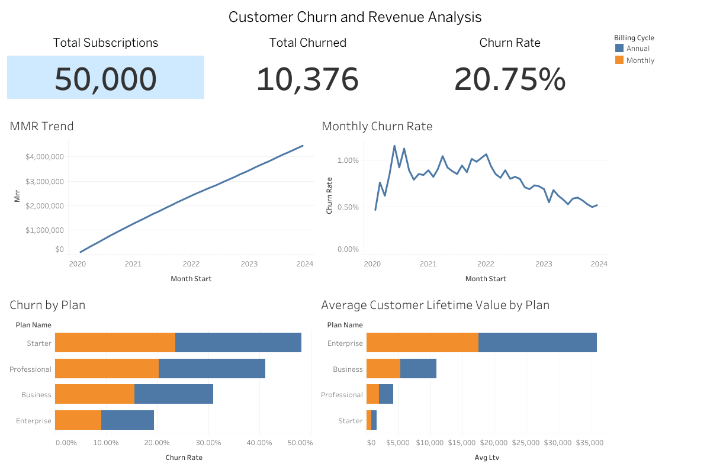

# Customer Churn and Revenue Analysis (SQL + Tableau)

## Interactive Dashboard

View the live Tableau dashboard here:

https://public.tableau.com/app/profile/tysir.shehadey/viz/customer_churn_dashboard_17725886086350/ChurnandRevenueDashboard

## Dashboard Preview

## Project Overview

This project demonstrates an end-to-end analytics workflow for analyzing customer churn and subscription revenue. The goal was to simulate a realistic SaaS analytics environment by building a relational dataset, performing advanced SQL analysis, and creating a professional analytics dashboard.

The analysis focuses on identifying churn trends, understanding revenue growth, and comparing customer lifetime value across subscription plans.

## Objectives

The analysis answers several key business questions:

• What is the overall customer churn rate?  
• How has monthly recurring revenue (MRR) changed over time?  
• Which subscription plans experience the highest churn?  
• Which plans generate the highest customer lifetime value?  
• How does churn trend month to month?

## Project Structure

customer-churn-sql-dashboard

dashboard  
customer_churn_dashboard.twbx

data_processed  
v_kpis.csv  
v_plan_churn.csv  
v_monthly_mrr.csv  
v_ltv_by_plan.csv  
v_churn_by_month.csv

sql  
saas_churn_simulation.sql

README.md

## SQL Analysis

The SQL script creates a simulated SaaS subscription environment and generates analytical views used for business analysis.

Key components include:

• Relational schema for customers, subscriptions, and billing data  
• Churn identification logic  
• Monthly recurring revenue calculations  
• Customer lifetime value calculations  
• Plan level churn comparisons

Analytical views created in SQL:

v_kpis  
v_plan_churn  
v_monthly_mrr  
v_ltv_by_plan  
v_churn_by_month

These views were exported as CSV files and used as inputs for the Tableau dashboard.

## Dashboard

The Tableau dashboard visualizes the most important metrics and trends from the SQL analysis.

The dashboard includes:

• Total Subscriptions KPI  
• Total Churned KPI  
• Overall Churn Rate  
• Monthly Recurring Revenue Trend  
• Monthly Churn Rate Trend  
• Churn Rate by Subscription Plan  
• Average Customer Lifetime Value by Plan

These visualizations allow quick identification of churn patterns and revenue performance across subscription tiers.

## Tools Used

SQL  
MySQL

Data Visualization  
Tableau

Data Processing  
CSV exports from SQL analytical views

## Author

Tysir Shehadey